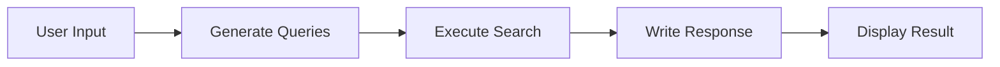

# 🔍 Local Perplexity

Uma versão local do Perplexity AI otimizada para hardwares com 8GB de RAM, utilizando LLMs locais via Ollama.

## ✨ Features

- 🧠 **LLMs Locais**: Roda completamente offline usando Ollama
- ⚡ **Otimizado para 8GB RAM**: Performance otimizada para hardwares limitados  
- 🌐 **Busca Web Inteligente**: Múltiplas queries via Tavily API
- 🎨 **Interface Dark Theme**: Visual idêntico ao Perplexity original
- 📝 **Formatação Markdown**: Respostas estruturadas estilo Notion/ChatGPT
- 🔄 **LangGraph Workflows**: Orquestração avançada de processos de IA
- 📱 **UI Responsiva**: Interface limpa e moderna

## 🚀 Performance

- **Antes da otimização**: 5-10 minutos por resposta
- **Após otimização**: ~30 segundos por resposta
- **Modelos suportados**: llama3.2:1b, llama3.2:3b
- **Consumo de RAM**: <4GB durante execução

## 🛠️ Stack Técnica

- **Frontend**: Streamlit
- **Backend**: Python 3.11+
- **LLM Framework**: LangChain + Ollama
- **Workflow**: LangGraph
- **Busca Web**: Tavily API
- **Modelagem**: Pydantic
- **Styling**: CSS customizado

## 📋 Pré-requisitos

- Python 3.11+
- Ollama instalado
- 8GB+ de RAM recomendado
- Conexão com internet (para buscas web)

## 🔧 Instalação

### 1. Clone o repositório
```bash
git clone https://github.com/seu-usuario/local-perplexity.git
cd local-perplexity
```

### 2. Crie um ambiente virtual
```bash
python -m venv venv
source venv/bin/activate  # Linux/Mac
# ou
venv\Scripts\activate     # Windows
```

### 3. Instale as dependências
```bash
pip install -r requirements.txt
```

### 4. Configure o Ollama
```bash
# Instale o Ollama (https://ollama.ai)
# Baixe o modelo otimizado
ollama pull llama3.2:1b
```

### 5. Configure as variáveis de ambiente
```bash
cp .env.example .env
# Edite o .env com suas chaves de API
```

### 6. Execute a aplicação
```bash
streamlit run perplexity_dark_theme.py
```

## ⚙️ Configuração

### Arquivo .env
```env
TAVILY_API_KEY=sua_chave_tavily_aqui
OLLAMA_HOST=127.0.0.1:11434
OLLAMA_MAX_LOADED_MODELS=1
OLLAMA_NUM_PARALLEL=1
```

### Obtendo Chave Tavily API
1. Acesse [tavily.com](https://tavily.com)
2. Crie uma conta gratuita
3. Gere sua API key
4. Adicione no arquivo `.env`

## 🎯 Como Usar

1. **Inicie a aplicação**: `streamlit run perplexity_dark_theme.py`
2. **Acesse no browser**: `http://localhost:8501`
3. **Digite sua pergunta** no campo de busca
4. **Clique em Search** e aguarde a resposta
5. **Visualize fontes** na seção Sources

## 📁 Estrutura do Projeto

```
local-perplexity/
├── perplexity_dark_theme.py    # Aplicação principal
├── schemas.py                  # Modelos Pydantic
├── utils.py                   # Funções de busca
├── prompts.py                 # Templates de prompts
├── requirements.txt           # Dependências Python
├── .env.example              # Exemplo de configuração
├── .gitignore               # Arquivos ignorados
└── README.md               # Este arquivo
```

## 🔄 Workflows

O sistema utiliza LangGraph para orquestrar o seguinte workflow:

1. **Generate Queries**: Gera 2-3 queries de busca otimizadas
2. **Execute Search**: Busca informações via Tavily API
3. **Write Response**: Sintetiza resposta usando LLM local



## ⚡ Otimizações para 8GB RAM

- **Modelo leve**: llama3.2:1b (~1.3GB)
- **Context window reduzido**: 3072 tokens
- **Queries limitadas**: Máximo 3 por busca
- **Cache de recursos**: Streamlit cache para LLM
- **Busca paralela**: ThreadPoolExecutor otimizado
- **Timeouts configurados**: Evita travamentos

## 🐛 Troubleshooting

### Problema: Ollama não encontrado
```bash
# Verifique se o Ollama está rodando
ollama list

# Se não estiver, inicie o serviço
ollama serve
```

### Problema: Memória insuficiente
```bash
# Use modelo menor
ollama pull llama3.2:1b

# Configure variáveis de ambiente
export OLLAMA_MAX_LOADED_MODELS=1
export OLLAMA_NUM_PARALLEL=1
```

### Problema: Timeout nas buscas
- Verifique sua conexão de internet
- Confirme se a chave Tavily API está correta
- Reduza o número de queries no código

## 🤝 Contribuindo

1. Fork o projeto
2. Crie uma branch para sua feature (`git checkout -b feature/nova-feature`)
3. Commit suas mudanças (`git commit -am 'Adiciona nova feature'`)
4. Push para a branch (`git push origin feature/nova-feature`)
5. Abra um Pull Request

## 📝 TODO

- [ ] Sistema de cache para respostas
- [ ] Histórico de conversas
- [ ] Suporte a múltiplos modelos
- [ ] Export de respostas em PDF
- [ ] Modo offline completo
- [ ] Interface web responsiva
- [ ] Integração com mais APIs de busca

## 📄 Licença

Este projeto está sob a licença MIT. Veja o arquivo [LICENSE](LICENSE) para mais detalhes.

## 🙏 Créditos

- **Ideia original**: [Asimov](https://asimov.academy)
- **Otimizações e melhorias**: Lucas Rosati Cavalcanti
- **Inspiração**: Perplexity AI

## 📞 Contato

- LinkedIn: [Lucas Rosati](https://www.linkedin.com/in/lucas-rosati-cavalcanti-pereira-b62229128/))
- GitHub: [@lucasrosati](https://github.com/lucasrosati)

---

⭐ Se este projeto te ajudou, considere dar uma estrela no repositório!
